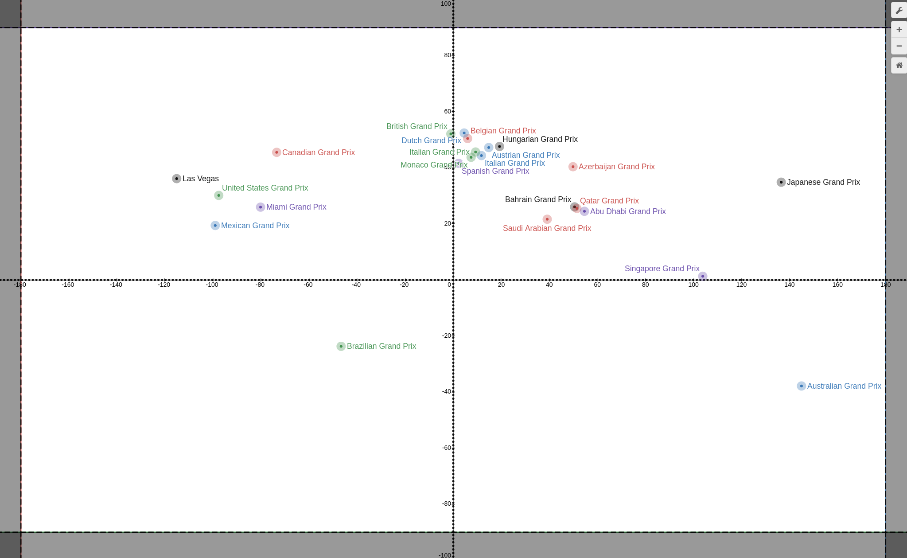

# Formula 1 Nearest Race Finder

This is a command-line application that allows you to find the nearest Formula 1 race based on your geographical location.

## Features

* Get the nearest Formula 1 race based on latitude and longitude.
* View details about the nearest race including race name, date, location, and distance from the input coordinates.

## Installation

1. Clone the repository

```bash
git clone https://github.com/santi224m/Formula-1-Nearest-Race-Finder.git
```

2. Enter the cloned directory

```bash
cd Formula-1-Nearest-Race-Finder/
```
3. Compile the program. The following example is for the gcc compiler.

```bash
g++ -o f1_nearest_race main.cpp
```

## Usage

You can use the application from the command-line like so:

```bash
./f1_nearest_race 33.8823 -117.8827
```

This will find the nearest Formula 1 race to the coordinates (33.8823 -117.8827).

## Implementation

This program will be implemented using a quadtree data structure to store the locations of all the Formula 1 races. The locations will be stored as latitude and longitude coordinates.



### Quadtree Construction

The quadtree will be constructed based on the minimum and maximum latitude and longitude values of the locations in the dataset. This will allow the quadtree to be as small as possible while still encompassing all the locations.

#### Nearest Neighbor Search

The program will perform a nearest neighbor search on the quadtree to find the Formula 1 race closest to the user's location.

#### Output

Once the nearest race is found, the program will display relevant information about the race to the user, including the name of the race, the date it will be held, and the distance from the user's location.

#### Race structure

```cpp
Race {
  String: race_name
  String: circuit_name
  Coordinate: coordinate
  Date: date  // using standard library tm struct
}

Coordinate {
  Double: latitude
  Double: longitude
}
```
