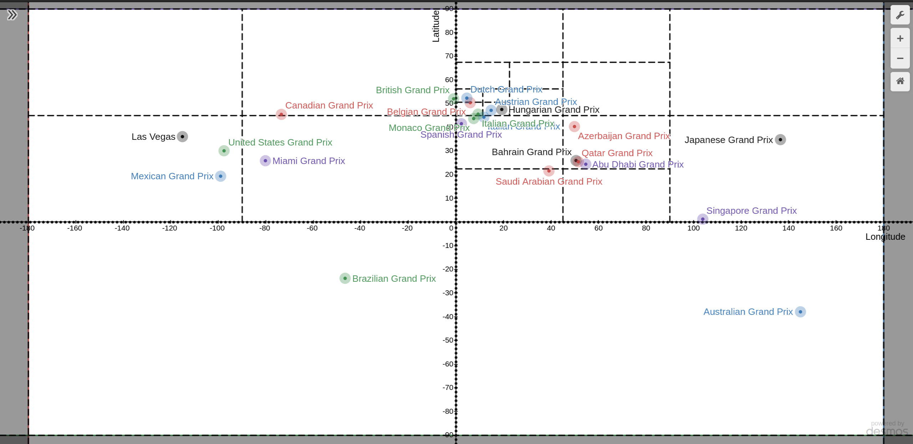

# Formula 1 Nearest Race Finder

This is a command-line application that allows you to find the nearest Formula 1 race to a geographical location.

## Features

* Get the nearest Formula 1 race based on latitude and longitude.
* View details about the nearest race including race name, location, date, and distance from the input coordinates.

## Installation

1. Clone the repository

```bash
git clone https://github.com/santi224m/Formula-1-Nearest-Race-Finder.git
```

2. Enter the cloned directory

```bash
cd Formula-1-Nearest-Race-Finder/
```
3. Compile the program. The following example is for the gcc compiler.

```bash
make main
```

## Usage

You can start the application from the command-line like so:

```bash
make run
```

## Implementation

This program is implemented using a quadtree data structure to store the locations of all the Formula 1 races. The locations are stored as latitude and longitude coordinates. You can see the desmos graph representation of the quadtree [here](https://www.desmos.com/calculator/gyz7rbaqzo).



### Quadtree Construction

The quadtree is constructed from data stored in a [csv file](./data/formula1_grand_prix_2023.csv). Each race is inserted into the quadtree one at a time. The quadtree then splits the races info subtrees. Each leaf node contains no more than 4 races. The CSV file contains the following data for each race:

* Race Name
* Circuit Name
* Coordinates
* Race Date

#### Nearest Neighbor Search

The program performs a nearest neighbor search on the quadtree to find the Formula 1 race closest to the coordinates that were input. The distance between coordinates is calculated using the Haversine formula.

#### Output

Once the nearest race is found, the program will display relevant information about the race to the user, including the name of the race, the date it will be held, and the distance from the user's location.

#### Race structure

```cpp
Race {
  String: race_name
  String: circuit_name
  Coordinate: coordinate
  Date: date  // using standard library tm struct
}

Coordinate {
  Double: latitude
  Double: longitude
}
```
